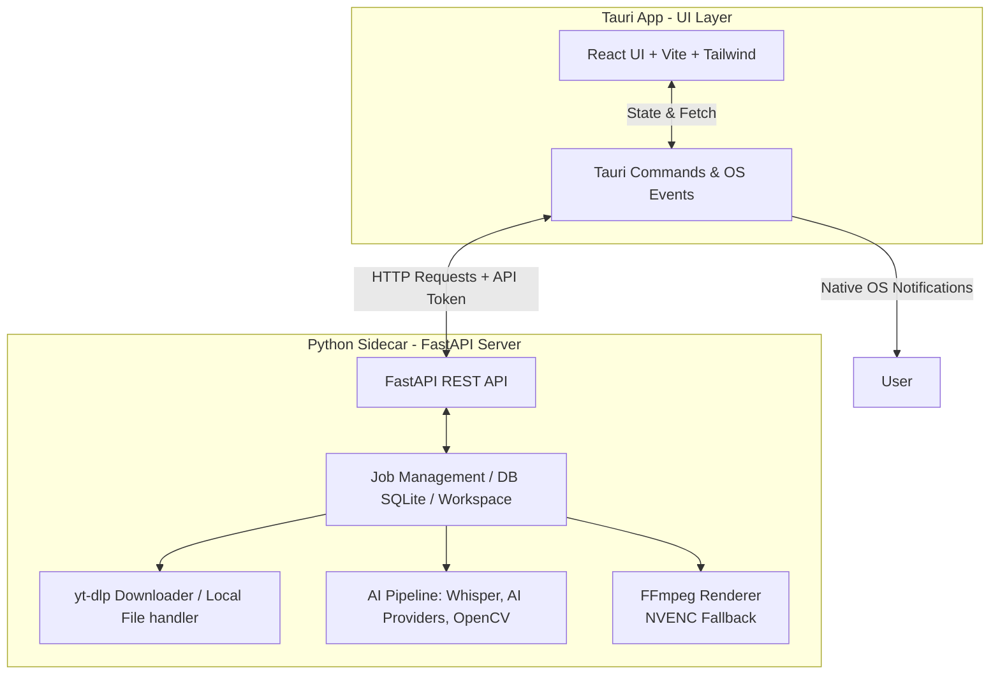
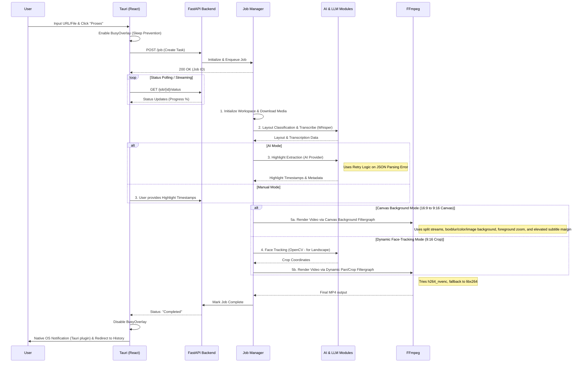

# Technical Design Document - Auto Clipper

Dokumen ini menjelaskan arsitektur teknis, diagram alur, dan interaksi komponen dalam aplikasi Auto Clipper.

## 1. High-Level Architecture

Aplikasi ini menggunakan model **Sidecar Architecture**, tetapi alih-alih hanya mengeksekusi skrip secara pasif, Sidecar Python beroperasi sebagai **Server API Lokal (FastAPI)**. Antarmuka pengguna (Frontend Tauri) dan mesin pemrosesan berinteraksi melalui HTTP REST API dan Token Autentikasi.

## 2. Alur Pemrosesan Video (Video Processing Flow)

Pekerjaan (Jobs) diatur oleh modul *Job Management* di Python. Sistem ini tangguh berkat adanya *retry logic* saat ekstraksi LLM dan penanganan background agar sistem operasi tidak tidur (Sleep Prevention / BusyOverlay).

## 3. Video Rendering & Filtergraph Pipelines

Sistem mendukung dua strategi perenderan video lanskap ke format vertikal 9:16:

### 3.1 Dynamic Face Tracking Pipeline (Standard Crop)
- **Face Trajectory Sampling**: OpenCV mendeteksi koordinat wajah pembicara (`sample_face_trajectory`) secara berkala.
- **Smoothing**: Menggunakan Exponential Moving Average (EMA, alpha = 0.25) untuk menghilangkan pergerakan kamera yang patah-patah (`smooth_trajectory`).
- **Dynamic Crop Filter**: FFmpeg mengeksekusi ekspresi `crop=w=ih*(9/16):h=ih:x=...` dinamis.

### 3.2 Canvas Background Styling & Zoom Pipeline
- **Split Stream Filtergraph**:
  - *Stream 1 (Background)*: Di-scale dan di-crop ke 1080x1920, kemudian diberi filter `boxblur=10:5` (light), `boxblur=25:10` (medium), atau `boxblur=50:20` (heavy). Alternatifnya menggunakan background warna solid (`color=c=0x...:s=1080x1920`) atau background gambar lokal (`movie=...`).
  - *Stream 2 (Foreground Video)*: Di-scale sesuai parameter `enlarge_scale` (1.0x - 2.0x, default 1080:608) tanpa merusak aspect ratio asli.
  - *Overlay*: Stream foreground ditumpuk di tengah stream background (`overlay=(W-w)/2:(H-h)/2`).
- **Adaptive Subtitle Margin**:
  - Penempatan teks subtitle karaoke (.ass) disesuaikan secara dinamis dengan menaikkan `MarginV` (atau `Alignment=2` pada area bawah frame video foreground) agar teks berada tepat di area kanvas kosong di bawah video.

## 4. Struktur Direktori Utama

- `src/`: Berisi kode sumber Frontend (React, Vite, Tailwind). Komponen UI (`CanvasConfigControls.tsx`), state management, dan modul i18n (Internationalization) ada di sini.
- `src-tauri/`: Kode Rust yang membungkus aplikasi web menjadi *desktop app*. Mendefinisikan kapabilitas *Native Notifications*, konfigurasi *sleep prevention*, dan eksekusi *sidecar* (`tauri.conf.json`).
- `backend/`: Kode Python (FastAPI). 
  - `main.py`: Entry point server web lokal & API schema `CanvasConfig`.
  - `jobs.py`: Scheduler dan handler pemrosesan dengan manajemen *Project Workspace* dan persistensi metadata.
  - `ai_utils.py`: Logika interaksi AI (Whisper, AI Provider Registry) yang dilengkapi metode fallback/retry.
  - `crop_utils.py`: Utilitas deteksi wajah (OpenCV), klasifikasi layout, generator kanvas background FFmpeg (`build_canvas_background_filter`), dan pembuat subtitle karaoke.
  - `db.py`: Koneksi dan model SQLite untuk manajemen riwayat.
- `bin/`: Direktori tempat executable *sidecar* dari PyInstaller disimpan (`backend-x86_64-pc-windows-msvc.exe`) sebelum dipanggil oleh Tauri.

## 4. Inter-Process Communication (IPC) & Keamanan

Komunikasi antara UI (Tauri) dan backend (Python) tidak lagi menggunakan *Standard Input/Output (stdio)* mentah. Saat Tauri dijalankan, ia membangunkan sidecar FastAPI di port lokal secara dinamis.

- **HTTP REST API**: Frontend Tauri melakukan inisiasi data (seperti URL/Video Path) melalui Endpoint POST, dan membaca *progress state* melalui Endpoint GET (Polling/Streaming).
- **Keamanan Token Lokal**: Akses ke Endpoint dibentengi oleh `API_SECRET_TOKEN` yang di-generate dinamis dari *stdout* saat Tauri membangunkan *sidecar*.
- **Developer Mode**: Saat pengembangan dengan `uvicorn` *auto-reload*, pengembang menyetel environment variable `$env:AUTO_CLIPPER_DEV_TOKEN="dev-token"` agar komunikasi frontend berjalan lancar tanpa proses parsing token dari *stdout*.
- **Sleep Prevention & OS Notifications**: Ketika backend sibuk merender, Tauri di sisi frontend menjaga OS agar tidak masuk status *Sleep* (melalui library terkait atau API native Tauri). Begitu server merespons "Selesai", Tauri akan membunyikan Notifikasi OS (OS Level, bukan HTML Web Toast biasa) yang mendukung multi-bahasa sesuai pengaturan *locale* user.
