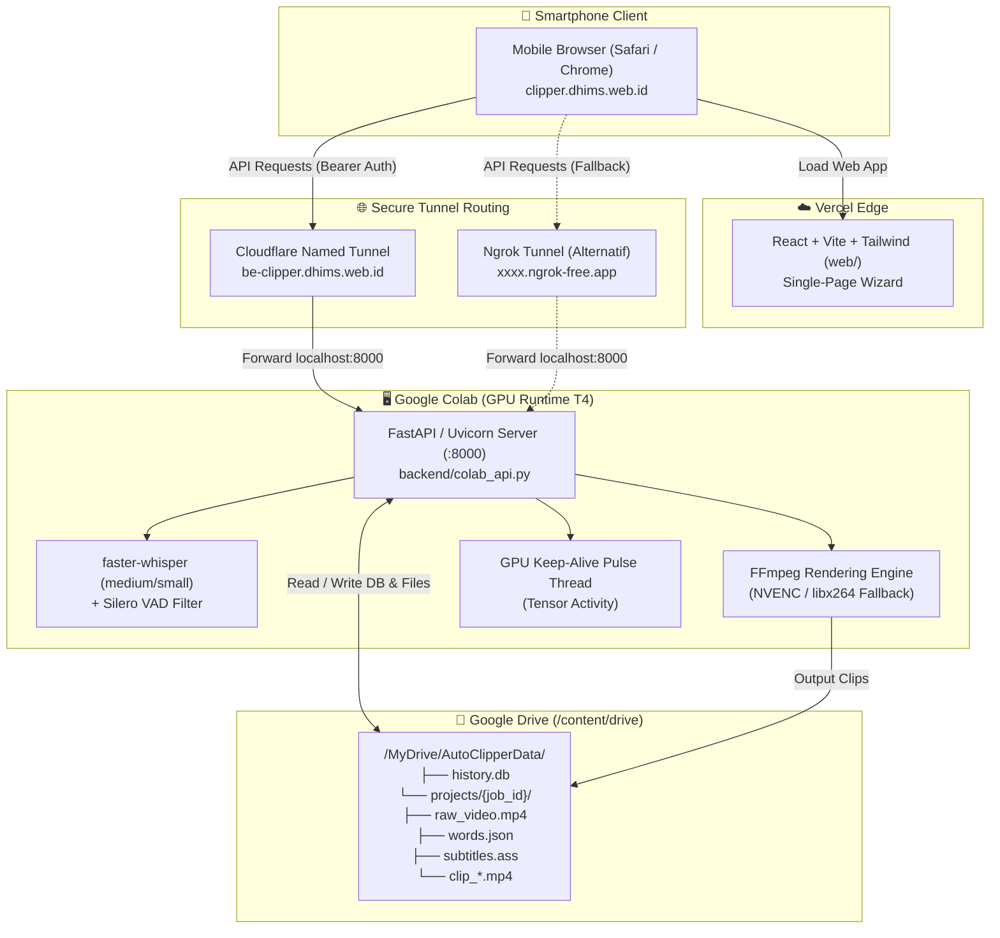

# Design Spec: Panduan Teknis Lengkap Auto Clipper Cloud

**Dokumen Target:** `docs/tutorial-auto-clipper-cloud.md`  
**Tanggal:** 2026-09-02  
**Status:** Approved by User  
**Tujuan:** Menyediakan panduan teknis komprehensif, terstruktur, dan *step-by-step* dalam Bahasa Indonesia untuk mengkonfigurasi infrastruktur, mendeploy, serta mengoperasikan Auto Clipper Cloud secara mandiri dengan backend GPU Google Colab, penyimpanan persisten Google Drive, tunneling Cloudflare/Ngrok, dan frontend Web Vercel yang diakses dari smartphone.

---

## 1. Latar Belakang & Ruang Lingkup

Auto Clipper memiliki varian cloud berbasis Web (*Mobile-First Web App*) di direktori `web/` yang berkomunikasi dengan backend FastAPI di Google Colab (`backend/colab_api.py`). Mode cloud ini memungkinkan pengguna memproses klip video otomatis dengan akselerasi GPU gratis (NVIDIA T4) tanpa membebani perangkat laptop/PC lokal dan dapat dioperasikan secara fleksibel dari browser smartphone.

Dokumen teknis ini dirancang untuk:
1. **Memandu Setup Infrastruktur Awal (*One-Time Setup*)**: Konfigurasi Google Drive, Google Colab GPU, Cloudflare Zero Trust Tunnel (serta alternatif Ngrok), dan deployment frontend ke Vercel.
2. **Memandu SOP Operasional Harian (*Daily Routine SOP*)**: Alur kerja pemotongan video dari smartphone menggunakan wizard 4 langkah (Input URL $\rightarrow$ Whisper Transcribe & Share AI Prompt $\rightarrow$ Submit JSON Highlights $\rightarrow$ Background Rendering & Download MP4).
3. **Menyediakan Panduan Pemeliharaan & Troubleshooting**: Solusi sistematis untuk mengatasi kendala umum seperti Colab timeout, reset token (401 Unauthorized), error CORS, optimasi VRAM GPU, dan pembersihan storage Google Drive.

---

## 2. Arsitektur & Diagram Topologi Sistem

---

## 3. Struktur & Blueprint Dokumen Tutorial (`docs/tutorial-auto-clipper-cloud.md`)

Dokumen tutorial akan disusun dalam 7 bab utama dengan rincian konten sebagai berikut:

### **Daftar Isi Dokumen**
1. **Ikhtisar & Konsep Auto Clipper Cloud**
   - Mengapa menggunakan mode Cloud?
   - Diagram Alur & Topologi Komponen.
   - Fitur Unggulan: Background Processing (*Bebas Tutup Browser*), GPU Acceleration gratis, dan Google Drive Persistence.
2. **Prasyarat & Persiapan Akun (One-Time Setup)**
   - Akun Google (Google Drive & Google Colab).
   - Akun Cloudflare (Zero Trust Free Tier) / Akun Ngrok.
   - Akun GitHub & Vercel.
   - Menentukan *Static API Secret Token* (`AUTO_CLIPPER_WEB_TOKEN`).
3. **Setup Backend Cloud (Google Colab & Google Drive)**
   - Langkah 1: Membuka notebook `Auto_Clipper_Colab.ipynb`.
   - Langkah 2: Mengaktifkan Runtime GPU (NVIDIA T4).
   - Langkah 3: Mounting Google Drive (`/content/drive`).
   - Langkah 4: Struktur folder persisten `/MyDrive/AutoClipperData/`.
   - Langkah 5: Eksekusi backend `backend/colab_api.py` dan cara kerja `gpu_keep_alive()`.
   - Langkah 6: Verifikasi status backend via health check (`/health`).
4. **Setup Konektivitas Tunnel Publik**
   - **Metode Utama: Cloudflare Zero Trust Named Tunnel**
     - Registrasi Named Tunnel (`colab-clipper`).
     - Konfigurasi Public Hostname: `be-clipper.dhims.web.id` $\rightarrow$ `http://localhost:8000`.
     - Menyalin Tunnel Token ke sel Colab.
   - **Metode Alternatif: Ngrok Tunnel Gratis (Tanpa Custom Domain)**
     - Cara mendapatkan `NGROK_AUTHTOKEN`.
     - Script eksekusi pyngrok di Colab.
     - Menyalin URL publik ngrok (`https://xxxx.ngrok-free.app`).
5. **Setup & Deployment Frontend Web ke Vercel**
   - Import repositori GitHub ke Vercel.
   - Konfigurasi Build & Output:
     - Root Directory: `web`
     - Framework Preset: `Vite`
     - Build Command: `npm run build`
     - Output Directory: `dist`
   - Konfigurasi Environment Variables: `VITE_API_URL` (Domain backend Cloudflare / Ngrok).
   - Pengaturan Custom Domain (`clipper.dhims.web.id`) dan verifikasi SSL/HTTPS.
6. **SOP Pengoperasian Harian via Smartphone (4-Step Wizard Flow)**
   - **Persiapan Sesi**: Menyalakan Colab (*Run All*) & membuka Web App di HP.
   - **Autentikasi**: Input password statis di `AuthGate` (tersimpan di `localStorage`).
   - **Step 1 (Input URL & Styling)**:
     - Paste URL video (YouTube, TikTok, dll.).
     - Pemilihan gaya kanvas (*Face Crop 9:16*, *Canvas Blur 9:16*, *Landscape 16:9*, *Square 1:1*).
     - Pemilihan preset subtitle (*Viral Pop*, *Podcast*, *Classic*).
     - Submit job transkripsi.
   - **Step 2 (Whisper Transcribe & Share AI Prompt)**:
     - Whisper memproses audio dan menghasilkan word-level timestamps.
     - Menekan tombol **📤 Share Prompt** (Web Share API) untuk meneruskan prompt ke aplikasi Gemini / ChatGPT / Claude di HP.
   - **Step 3 (Submit Highlights JSON)**:
     - Salin respons JSON dari AI.
     - Tempel ke textarea Web UI dan klik **Render Clips**.
   - **Step 4 (Background Rendering & Download MP4)**:
     - FFmpeg memproses pemotongan, tracking wajah, kanvas, dan subtitle di Colab.
     - Pengguna dapat menutup browser HP secara bebas selama proses rendering.
     - Buka kembali Web UI saat selesai, putar video inline, dan unduh berkas `.mp4` ke galeri HP.
7. **Panduan Pemeliharaan, Troubleshooting & FAQ**
   - **Masalah 1**: Sesi Colab Terputus / Idle Disconnect (Cara *reconnect*, data tetap aman di Google Drive).
   - **Masalah 2**: Error `401 Unauthorized` (Penyebab & cara reset `ac_web_token`).
   - **Masalah 3**: Error `CORS / Network Error` (Validasi whitelist regex CORS dan URL tunnel).
   - **Masalah 4**: GPU Memory Out-of-Memory & Otomasi Fallback NVENC $\rightarrow$ CPU.
   - **Masalah 5**: Manajemen Penyimpanan Google Drive (Panduan menghapus cache folder `projects/` lama).

---

## 4. Rencana Integrasi & Tautan Dokumentasi

1. **Membuat Berkas Baru:** `docs/tutorial-auto-clipper-cloud.md`.
2. **Memperbarui `README.md`:** Menambahkan seksi atau tautan ke panduan Auto Clipper Cloud pada bagian *Deployment / Cloud Backend*.

---

## 5. Kriteria Verifikasi

- [ ] Seluruh instruksi teknis, perintah bash/python, dan konfigurasi form sesuai dengan implementasi aktual pada `backend/colab_api.py`, `Auto_Clipper_Colab.ipynb`, dan `web/`.
- [ ] Format markdown rapi, menggunakan GitHub alerts (`NOTE`, `TIP`, `IMPORTANT`, `WARNING`), mermaid diagram, dan code fences yang jelas.
- [ ] Navigasi dokumen memiliki Table of Contents yang fungsional dengan anchor link.
