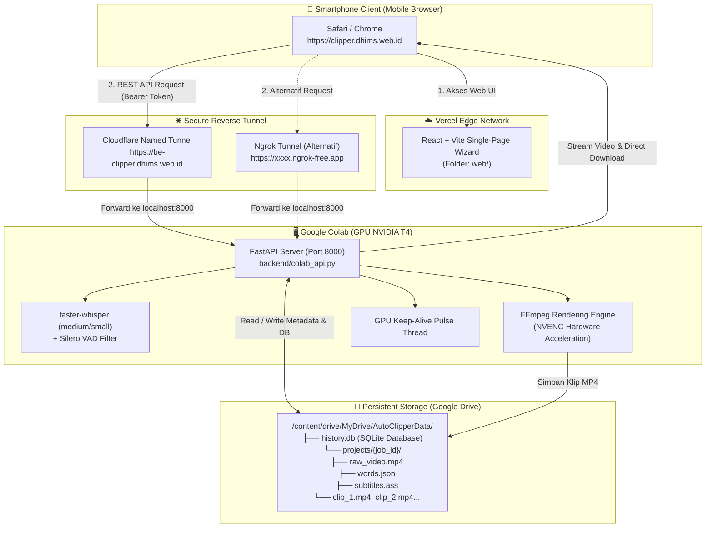
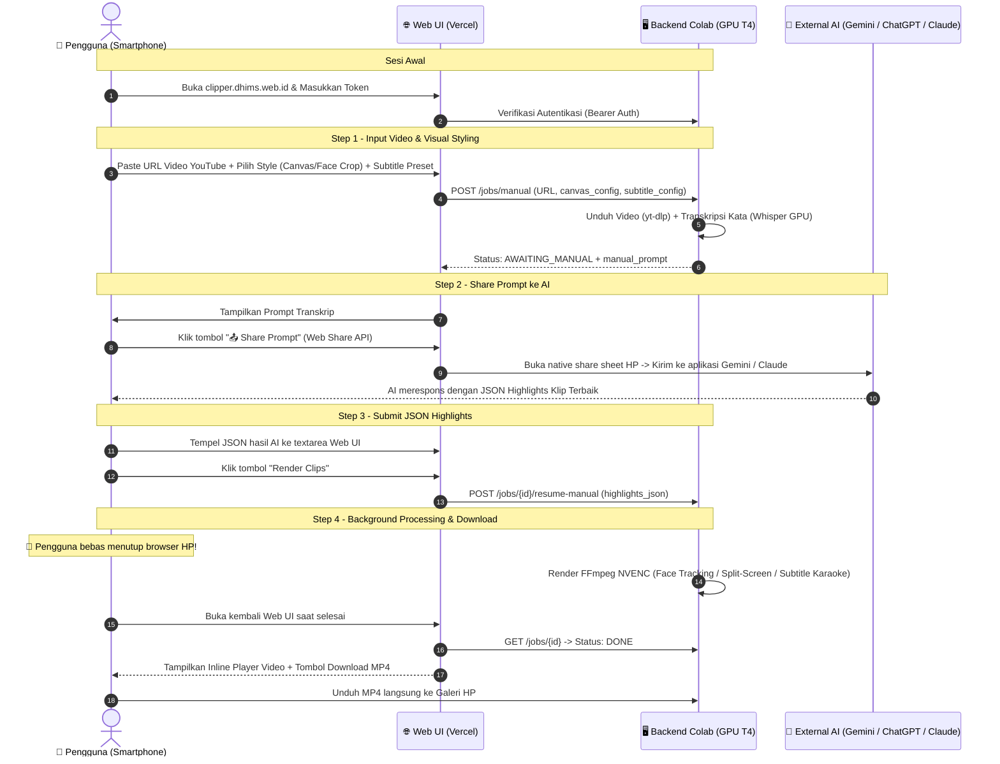

# ☁️ Panduan Teknis Lengkap: Menjalankan Auto Clipper Cloud

Dokumentasi ini merupakan panduan teknis resmi *end-to-end* untuk mengonfigurasi, mendeploy, dan mengoperasikan **Auto Clipper Cloud**. Dengan arsitektur ini, seluruh proses berat (transkripsi suara dengan Whisper, *face tracking*, pembuatan kanvas dinamis, dan *rendering* video FFmpeg dengan akselerasi hardware NVIDIA NVENC) dijalankan pada **GPU Google Colab (T4 GPU Gratis)** dengan penyimpanan persisten di **Google Drive**, serta diakses secara praktis melalui antarmuka **Web App Smartphone (Vercel)**.

---

## 📑 Daftar Isi

1. [Ikhtisar & Arsitektur Sistem](#1-ikhtisar--arsitektur-sistem)
   - [Diagram Aliran Data & Topologi](#diagram-aliran-data--topologi)
   - [Keunggulan Mode Cloud](#keunggulan-mode-cloud)
2. [Prasyarat & Persiapan Akun (One-Time Setup)](#2-prasyarat--persiapan-akun-one-time-setup)
3. [Setup Backend Cloud (Google Colab & Google Drive)](#3-setup-backend-cloud-google-colab--google-drive)
   - [Langkah 3.1: Membuka Notebook Colab](#langkah-31-membuka-notebook-colab)
   - [Langkah 3.2: Memastikan Hardware Accelerator T4 GPU](#langkah-32-memastikan-hardware-accelerator-t4-gpu)
   - [Langkah 3.3: Mounting Google Drive & Struktur Workspace](#langkah-33-mounting-google-drive--struktur-workspace)
   - [Langkah 3.4: Eksekusi Server & Mekanisme GPU Keep-Alive](#langkah-34-eksekusi-server--mekanisme-gpu-keep-alive)
   - [Langkah 3.5: Verifikasi Health Check Backend](#langkah-35-verifikasi-health-check-backend)
4. [Setup Konektivitas Tunnel Publik](#4-setup-konektivitas-tunnel-publik)
   - [Metode 1: Cloudflare Zero Trust Tunnel (Rekomendasi Custom Domain)](#metode-1-cloudflare-zero-trust-tunnel-rekomendasi-custom-domain)
   - [Metode 2: Ngrok Tunnel (Opsi Alternatif Gratis Tanpa Domain)](#metode-2-ngrok-tunnel-opsi-alternatif-gratis-tanpa-domain)
5. [Setup & Deployment Frontend Web ke Vercel](#5-setup--deployment-frontend-web-ke-vercel)
   - [Langkah 5.1: Import Repositori ke Vercel](#langkah-51-import-repositori-ke-vercel)
   - [Langkah 5.2: Konfigurasi Root Directory & Build Settings](#langkah-52-konfigurasi-root-directory--build-settings)
   - [Langkah 5.3: Pengaturan Environment Variable](#langkah-53-pengaturan-environment-variable)
   - [Langkah 5.4: Konfigurasi Custom Domain & Pengujian](#langkah-54-konfigurasi-custom-domain--pengujian)
6. [SOP Pengoperasian Harian via Smartphone (4-Step Wizard)](#6-sop-pengoperasian-harian-via-smartphone-4-step-wizard)
   - [Langkah 0: Inisialisasi Sesi & Login](#langkah-0-inisialisasi-sesi--login)
   - [Step 1: Input URL & Pemilihan Gaya Video](#step-1-input-url--pemilihan-gaya-video)
   - [Step 2: Transkripsi Whisper & Share Prompt ke AI](#step-2-transkripsi-whisper--share-prompt-ke-ai)
   - [Step 3: Submit JSON Highlights dari AI](#step-3-submit-json-highlights-dari-ai)
   - [Step 4: Background Rendering & Download MP4](#step-4-background-rendering--download-mp4)
7. [Panduan Pemeliharaan, Troubleshooting & FAQ](#7-panduan-pemeliharaan-troubleshooting--faq)
   - [Kendala 1: Sesi Google Colab Terputus / Idle Timeout](#kendala-1-sesi-google-colab-terputus--idle-timeout)
   - [Kendala 2: Error 401 Unauthorized / Token Mismatch](#kendala-2-error-401-unauthorized--token-mismatch)
   - [Kendala 3: Error CORS atau Network Connection Failed](#kendala-3-error-cors-atau-network-connection-failed)
   - [Kendala 4: Memory GPU Penuh (OOM) & Fallback Otomatis NVENC](#kendala-4-memory-gpu-penuh-oom--fallback-otomatis-nvenc)
   - [Kendala 5: Manajemen & Pembersihan Kapasitas Google Drive](#kendala-5-manajemen--pembersihan-kapasitas-google-drive)

---

## 1. Ikhtisar & Arsitektur Sistem

Auto Clipper Cloud memisahkan antarmuka pengguna (*Frontend*) dengan mesin komputasi berat (*Backend*). Pengguna mengontrol alur kerja dari browser smartphone (iOS Safari / Android Chrome) yang di-host di Vercel, sementara pemrosesan AI dan video dioperasikan di VM Google Colab yang dilengkapi GPU NVIDIA T4.

### Diagram Aliran Data & Topologi



### Keunggulan Mode Cloud

1. **Bebas Kebutuhan Spesifikasi Komputer**: Tidak memerlukan PC gaming atau kartu grafis mahal. Cukup gunakan HP dengan koneksi internet.
2. **Akselerasi GPU T4 Gratis**: Pemotongan video 9:16, tracking wajah dinamis, dan rendering subtitle karaoke berjalan hingga 4x–8x lebih cepat berkat hardware encoding `h264_nvenc`.
3. **Penyimpanan Persisten & Kebal Disconnect**: Riwayat klip, video sumber, dan file proyek tersimpan permanen di Google Drive Anda. Jika sesi Colab terputus, pekerjaan tidak hilang dan dapat dilanjutkan (*resume*).
4. **Alur Kerja Asinkron (*Bebas Tutup Browser*)**: Saat FFmpeg merender klip di Colab, Anda dapat menutup browser smartphone dan melakukan aktivitas lain. Ketika browser dibuka kembali, sistem akan menyinkronkan status secara otomatis.

---

## 2. Prasyarat & Persiapan Akun (One-Time Setup)

Sebelum menjalankan Auto Clipper Cloud untuk pertama kali, siapkan akun dan token berikut:

| Komponen | Kegunaan | Biaya | Pendaftaran |
|---|---|---|---|
| **Akun Google** | Akses Google Colab & Google Drive | Gratis (15 GB) | [google.com](https://google.com) |
| **Akun GitHub** | Repository hosting kode Auto Clipper | Gratis | [github.com](https://github.com) |
| **Akun Vercel** | Hosting antarmuka Frontend Web | Gratis (Hobby Tier) | [vercel.com](https://vercel.com) |
| **Cloudflare Zero Trust** *(Disarankan)* | Tunnel aman dengan custom domain | Gratis (Free Tier) | [dash.cloudflare.com](https://dash.cloudflare.com) |
| **Akun Ngrok** *(Alternatif)* | Tunnel instan tanpa domain | Gratis (Free Tier) | [ngrok.com](https://ngrok.com) |

> [!IMPORTANT]
> **Tentukan Static API Secret Token:**
> Siapkan sebuah kata sandi rahasia yang kuat (misalnya: `rahasia-clipper-2026-xyz`). Token ini akan digunakan bersama antara Colab Backend (`API_SECRET_TOKEN`) dan Web App di HP untuk mencegah akses tanpa izin dari publik.

---

## 3. Setup Backend Cloud (Google Colab & Google Drive)

### Langkah 3.1: Membuka Notebook Colab

1. Buka [Google Colab](https://colab.research.google.com/).
2. Pilih tab **GitHub**, masukkan URL repository `https://github.com/DhimasPH/auto-clipper` (atau upload file [`Auto_Clipper_Colab.ipynb`](../Auto_Clipper_Colab.ipynb)).
3. Buka file **`Auto_Clipper_Colab.ipynb`**.

### Langkah 3.2: Memastikan Hardware Accelerator T4 GPU

1. Pada menu navigasi Colab, klik **Runtime** $\rightarrow$ **Change runtime type** (*Ubah jenis runtime*).
2. Di bagian **Hardware accelerator**, pilih **T4 GPU**.
3. Pastikan **GPU RAM** muncul di status bar kanan atas.

> [!WARNING]
> Jika runtime berjalan pada mode standard **CPU**, transkripsi Whisper dan rendering FFmpeg akan berjalan jauh lebih lambat dan fitur NVENC tidak dapat digunakan.

### Langkah 3.3: Mounting Google Drive & Struktur Workspace

Jalankan **Cell 1**:
```python
from google.colab import drive
drive.mount('/content/drive')
```
*Klik tautan persetujuan dan berikan izin akses ke Google Drive Anda.*

Setelah ter-mount, backend secara otomatis membuat direktori kerja persisten di:
```text
/content/drive/MyDrive/AutoClipperData/
├── history.db                  # Database riwayat job & status klip
└── projects/                   # Folder isolasi per proyek
    └── {job_id}/
        ├── source.mp4          # Video mentah asli dari yt-dlp
        ├── source.words.json   # Timestamp per kata dari Whisper
        ├── subtitles.ass       # Format subtitle karaoke / standard
        └── clip_1.mp4          # Potongan video siap unduh
```

### Langkah 3.4: Eksekusi Server & Mekanisme GPU Keep-Alive

Jalankan **Cell 2 & 3** untuk menginstal dependensi sistem dan cloning repo:
```bash
!apt-get update -qq && apt-get install -y -qq ffmpeg
!wget -q https://github.com/cloudflare/cloudflared/releases/latest/download/cloudflared-linux-amd64.deb && dpkg -i cloudflared-linux-amd64.deb
!git clone https://github.com/DhimasPH/auto-clipper.git /content/auto-clipper || true
%cd /content/auto-clipper
!pip install -q -r backend/requirements.txt uvicorn pyngrok
```

Pada **Cell 4**, masukkan token konfigurasi Anda:
```python
#@title Run Auto Clipper Backend
CLOUDFLARE_TUNNEL_TOKEN = "eyJhIjoi..." #@param {type:"string"}
API_SECRET_TOKEN = "password-rahasia-anda" #@param {type:"string"}

!python backend/colab_api.py --cloudflare-token "$CLOUDFLARE_TUNNEL_TOKEN" --api-token "$API_SECRET_TOKEN"
```

#### Cara Kerja `gpu_keep_alive()` di Colab:
Backend menyertakan modul otomatis (`backend/colab_api.py`) yang mengalokasikan tensor memori GPU ringan (~400MB) dan mengirimkan pulsa komputasi mikro setiap 15 detik. Ini mencegah Google Colab menandai sesi sebagai *idle* dan memutus koneksi saat Anda sedang menunggu respons AI.

### Langkah 3.5: Verifikasi Health Check Backend

Buka tab baru di browser Anda dan akses endpoint:
```http
GET https://be-clipper.dhims.web.id/health
```
Respons yang diharapkan:
```json
{
  "status": "ok",
  "version": "1.14.0",
  "gpu_available": true
}
```

---

## 4. Setup Konektivitas Tunnel Publik

Karena Google Colab berjalan di dalam jaringan virtual Google yang tertutup, kita membutuhkan *reverse tunnel* agar browser HP dapat mengirim request ke backend FastAPI (port 8000).

---

### Metode 1: Cloudflare Zero Trust Tunnel (Rekomendasi Custom Domain)

Metode ini memberikan URL HTTPS yang stabil dan permanen (misal: `https://be-clipper.dhims.web.id`) tanpa perlu mengganti konfigurasi di frontend setiap kali Colab dinyalakan ulang.

1. Buka [Cloudflare Zero Trust Dashboard](https://one.dash.cloudflare.com/).
2. Masuk ke menu **Networks** $\rightarrow$ **Tunnels** $\rightarrow$ klik **Create a tunnel**.
3. Pilih tipe **Cloudflared**, beri nama tunnel (misal: `colab-clipper`), lalu klik **Save tunnel**.
4. Di bagian *Install and run a connector*, pilih tab **Debian (64-bit)** dan salin token tunnel (string panjang setelah `--token`).
5. Masuk ke tab **Public Hostname** pada tunnel tersebut, klik **Add a public hostname**:
   - **Subdomain:** `be-clipper`
   - **Domain:** `dhims.web.id` (pilih domain Anda yang terdaftar di Cloudflare)
   - **Type:** `HTTP`
   - **URL:** `localhost:8000`
6. Klik **Save hostname**.
7. Tempel token yang disalin ke kolom `CLOUDFLARE_TUNNEL_TOKEN` di notebook Colab.

---

### Metode 2: Ngrok Tunnel (Opsi Alternatif Gratis Tanpa Domain)

Jika Anda belum memiliki domain pribadi di Cloudflare, Anda dapat menggunakan Ngrok:

1. Daftar akun di [ngrok.com](https://ngrok.com) dan buka halaman **Your Authtoken**.
2. Salin token autentikasi Anda.
3. Di Google Colab, jalankan blok Python alternatif berikut:
```python
from pyngrok import ngrok
import os

NGROK_AUTHTOKEN = "TOKEN_NGROK_ANDA"
ngrok.set_auth_token(NGROK_AUTHTOKEN)

# Buka HTTP tunnel ke port 8000
public_url = ngrok.connect(8000).public_url
print(f"🚀 Public Backend URL: {public_url}")

os.environ["API_SECRET_TOKEN"] = "password-rahasia-anda"
os.environ["AUTO_CLIPPER_DEV_TOKEN"] = "password-rahasia-anda"
os.environ["AUTO_CLIPPER_CLOUD_MODE"] = "1"
os.environ["AUTO_CLIPPER_WORKSPACE"] = "/content/drive/MyDrive/AutoClipperData"

!python -m uvicorn backend.main:app --host 0.0.0.0 --port 8000
```
4. Salin URL publik yang dihasilkan (misal: `https://abcd-123-45.ngrok-free.app`) untuk digunakan pada frontend web.

---

## 5. Setup & Deployment Frontend Web ke Vercel

Frontend Web Auto Clipper terletak pada sub-direktori `web/` dan berbasis **React 18 + Vite + Tailwind CSS**.

### Langkah 5.1: Import Repositori ke Vercel

1. Buka dashboard [Vercel](https://vercel.com) dan klik **Add New...** $\rightarrow$ **Project**.
2. Hubungkan akun GitHub Anda dan pilih repositori `auto-clipper`.

### Langkah 5.2: Konfigurasi Root Directory & Build Settings

Pada halaman konfigurasi proyek Vercel:
- **Project Name:** `auto-clipper-web` (atau sesuai keinginan Anda).
- **Framework Preset:** `Vite`.
- **Root Directory:** Klik **Edit** dan pilih folder `web` (Penting!).
- **Build Command:** `npm run build` (default).
- **Output Directory:** `dist` (default).
- **Install Command:** `npm install` (default).

### Langkah 5.3: Pengaturan Environment Variable

Buka bagian **Environment Variables** dan tambahkan variabel berikut:

| Nama Variabel | Nilai Contoh | Keterangan |
|---|---|---|
| `VITE_API_URL` | `https://be-clipper.dhims.web.id` | URL domain backend Cloudflare Tunnel (atau URL Ngrok) |

### Langkah 5.4: Konfigurasi Custom Domain & Pengujian

1. Klik **Deploy**. Tunggu proses build selesai (~1-2 menit).
2. Setelah deployment berhasil, masuk ke **Settings** $\rightarrow$ **Domains**.
3. Tambahkan custom domain Anda (contoh: `clipper.dhims.web.id`).
4. Atur DNS CNAME di penyedia domain Anda mengarah ke `cname.vercel-dns.com`.
5. Buka `https://clipper.dhims.web.id` di browser smartphone untuk menguji antarmuka.

---

## 6. SOP Pengoperasian Harian via Smartphone (4-Step Wizard)

Setelah seluruh infrastruktur terpasang, berikut adalah alur kerja harian untuk memotong video langsung dari smartphone:



---

### Langkah 0: Inisialisasi Sesi & Login
1. Buka notebook Google Colab di browser laptop atau tab HP, lalu klik **Run All**.
2. Buka `https://clipper.dhims.web.id` di browser smartphone (Safari di iOS / Chrome di Android).
3. Masukkan **API Secret Token** yang sudah Anda tentukan. Token ini otomatis disimpan di `localStorage` browser Anda sehingga Anda tidak perlu memasukkannya berulang kali.

---

### Step 1: Input URL & Pemilihan Gaya Video
1. **Tempel URL Video**: Masukkan tautan YouTube, TikTok, atau Instagram.
2. **Pilih Gaya Tata Letak (Output Style)**:
   - 🎯 **Face Crop (9:16)**: Memotong video landscape menjadi vertikal dengan pelacakan wajah otomatis (*dynamic face tracking*).
   - 🧊 **Canvas Blur (9:16)**: Menempatkan video utuh di atas latar belakang blur estetik (pilihan blur: *Light*, *Medium*, *Heavy* serta zoom *1.0x - 2.0x*).
   - 🖥️ **Landscape (16:9)**: Mempertahankan rasio horizontal asli.
   - ⬜ **Square (1:1)**: Format persegi untuk feed media sosial.
3. **Pilih Preset Subtitle**:
   - 🎤 **Viral Pop (Default)**: Kata per kata aktif (*single-word pop karaoke*) huruf kapital tebal (Impact/Alex Hormozi style) dengan anti-overlap.
   - 📺 **Podcast**: Subtitle kalimat dengan sorotan kata aktif warna-warni (Montserrat font).
   - 📝 **Classic**: Subtitle kalimat standar elegan (Arial font).
4. Klik tombol **Start Transcription**.

---

### Step 2: Transkripsi Whisper & Share Prompt ke AI
1. Backend Colab akan mengunduh video via `yt-dlp` dan mengekstrak transkrip kata ber-timestamp menggunakan `faster-whisper`.
2. Setelah transkripsi selesai, status job berubah menjadi **`AWAITING_MANUAL`**.
3. Di layar HP Anda akan muncul prompt AI yang sudah diformat lengkap dengan transkrip video.
4. Tekan tombol **📤 Share Prompt**:
   - Browser akan memicu *Web Share API* bawaan sistem operasi smartphone Anda.
   - Pilih aplikasi AI yang Anda gunakan di HP (Google Gemini, ChatGPT, Claude, atau aplikasi Notes).
   - *(Atau gunakan tombol **📋 Copy Prompt** jika ingin menyalin manual).*

---

### Step 3: Submit JSON Highlights dari AI
1. AI pada aplikasi chat Anda akan menganalisis transkrip dan memberikan rekomendasi klip paling viral dalam format JSON, contoh:
```json
[
  {
    "start": 45.2,
    "end": 95.8,
    "title": "Rahasia Sukses Bisnis di Usia Muda",
    "hook_reason": "Pernyataan kontroversial pembicara di awal menit"
  }
]
```
2. Salin teks JSON tersebut dari chat AI.
3. Kembali ke Web App Auto Clipper di HP Anda, tempel ke kolom teks yang disediakan.
4. Klik tombol **🚀 Render Clips**.

---

### Step 4: Background Rendering & Download MP4
1. Backend Colab mulai memotong video, menghitung interpolasi tracking wajah, merender filter kanvas, dan menempelkan subtitle ASS secara presisi dengan GPU hardware acceleration.
2. **Kebebasan Menutup Browser:** Anda **bisa menutup browser smartphone** atau mematikan layar HP. Pemrosesan tetap berjalan aman di Colab.
3. Saat Anda membuka kembali web `https://clipper.dhims.web.id`, halaman otomatis memulihkan status job terakhir.
4. Setelah status menjadi **`DONE`**, daftar klip video akan muncul:
   - Putar video langsung di browser menggunakan inline player.
   - Klik tombol **⬇️ Download MP4** untuk menyimpan video langsung ke galeri foto/video smartphone Anda.

---

## 7. Panduan Pemeliharaan, Troubleshooting & FAQ

### Kendala 1: Sesi Google Colab Terputus / Idle Timeout
* **Penyebab:** Google Colab gratis memiliki batas durasi maksimal sesi kontinu dan dapat terputus jika tidak ada aktivitas tab dalam waktu lama.
* **Solusi & Mitigasi:**
  1. Jangan khawatir kehilangan data: semua transkrip, database `history.db`, dan klip yang telah selesai dirender tersimpan permanen di Google Drive Anda.
  2. Buka notebook Colab kembali, klik **Connect / Reconnect**, lalu jalankan kembali seluruh sel (**Run All**).
  3. Buka Web App di HP Anda: sistem akan kembali terhubung ke backend dan mendeteksi riwayat job sebelumnya dari database.

---

### Kendala 2: Error 401 Unauthorized / Token Mismatch
* **Penyebab:** Token yang dimasukkan di Web UI HP tidak sama dengan `API_SECRET_TOKEN` yang berjalan di sel Colab.
* **Solusi:**
  1. Buka menu pengaturan browser HP Anda atau hapus data *local storage* untuk situs `clipper.dhims.web.id`.
  2. Muat ulang halaman, maka form **AuthGate (Login)** akan muncul kembali.
  3. Masukkan kata sandi yang sesuai dengan yang Anda tuliskan pada sel Colab.

---

### Kendala 3: Error CORS atau Network Connection Failed
* **Penyebab:** Request dari domain Vercel diblokir oleh header backend, atau tunnel Cloudflare/Ngrok sedang offline.
* **Solusi:**
  1. Pastikan sel backend Colab sedang aktif dan tidak berhenti dengan error.
  2. Uji endpoint `https://be-clipper.dhims.web.id/health` di browser untuk memastikan tunnel aktif.
  3. Backend Auto Clipper sudah dilengkapi konfigurasi CORS komprehensif pada `backend/main.py`:
     ```python
     allow_origin_regex=r"https?://([a-zA-Z0-9_.-]+\.)?localhost(:\d+)?|https?://127\.0\.0\.1(:\d+)?|tauri://.*|app://.*|https://.*\.vercel\.app|https://clipper\.dhims\.web\.id"
     ```

---

### Kendala 4: Memory GPU Penuh (OOM) & Fallback Otomatis NVENC
* **Penyebab:** Video input memiliki resolusi sangat tinggi (4K/60fps) atau durasi transkripsi sangat panjang.
* **Solusi:**
  1. Auto Clipper secara otomatis mendeteksi ketersediaan memori GPU. Jika encoder hardware `h264_nvenc` mengalami kendala, pipeline secara *fail-safe* beralih ke software encoding CPU `libx264`.
  2. Untuk transkripsi video panjang di atas 1 jam, gunakan model Whisper `small` atau `medium` yang ramah memori.

---

### Kendala 5: Manajemen & Pembersihan Kapasitas Google Drive
* **Penyebab:** File video mentah `.mp4` berukuran besar dari YouTube dapat menghabiskan kuota 15 GB Google Drive seiring berjalannya waktu.
* **Solusi Pembersihan:**
  1. Buka Google Drive Anda di browser $\rightarrow$ buka folder `AutoClipperData` $\rightarrow$ `projects`.
  2. Hapus subfolder job proyek lama yang sudah selesai diunduh ke HP.
  3. **Jangan menghapus** file `history.db` jika Anda ingin tetap mempertahankan daftar riwayat klip di aplikasi web.
  4. Kosongkan *Trash / Sampah* di Google Drive Anda untuk membebaskan ruang penyimpanan secara permanen.

---

## 🎯 Kesimpulan

Dengan setup **Auto Clipper Cloud**, Anda memiliki studio klip video otomatis berbasis AI kelas profesional yang ditenagai infrastruktur cloud GPU gratis dan dapat dioperasikan secara fleksibel di mana saja langsung dari genggaman smartphone Anda.
